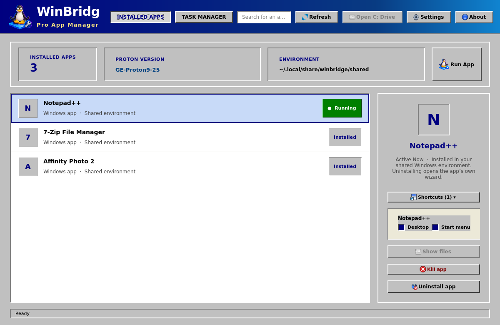
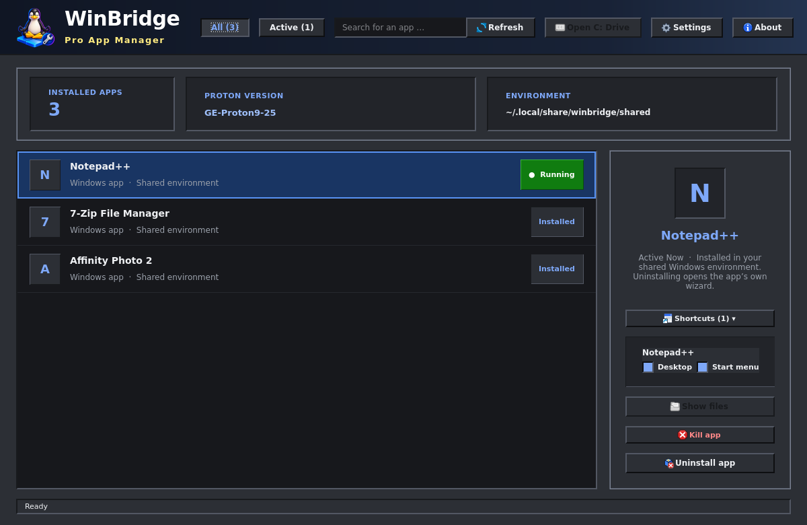

# WinBridge

**Windows apps. At home on Linux.**

WinBridge lets you open Windows `.exe` files from your Linux desktop using Proton. Run installers and portable apps in one shared Windows environment, and access your Windows programs alongside your Linux applications.

**WinBridge Manager** brings your Windows programs together in a native Qt desktop app, with a searchable library, shortcut controls, and built-in access to each program's uninstaller.

For installation, build instructions, and configuration, see [INSTALL.md](INSTALL.md).

## What WinBridge does

- **Run Windows programs:** Open `.exe` files from KDE, GNOME, or another desktop environment. Choose Proton once and reuse that choice on later launches.
- **Find your Proton versions:** Discover Proton in Steam libraries and custom builds such as GE-Proton.
- **Share one Windows environment:** Apps use the same Windows registry and installed components, and multiple programs can run at the same time.
- **Integrate with your desktop:** Import supported shortcuts exported by Proton into the Linux application menu and desktop.

## WinBridge Manager

Open **WinBridge Manager** from your application menu to browse and manage your Windows programs.

- **Program library and search:** Browse registered programs with their icons and quickly filter the list.
- **Uninstall programs:** Launch a program's Windows uninstaller and automatically clean up its shortcuts and icons afterward.
- **Control shortcuts:** Enable or disable desktop and application menu entries independently for each app.
- **Manage running apps:** See which programs are running and stop frozen processes with **Kill app**.
- **Browse Windows files:** Open the shared **C:** drive in your desktop file manager.
- **Customize your setup:** Choose a Proton version, the Windows environment location, and English or Norwegian Bokmål in Settings.

## A familiar retro desktop

The Manager offers two Windows 9x-inspired themes: **Classic Light (Windows 98)** and **Retro Dark (Plus! Mystery)**, with live previews in Settings.

## Compatibility

WinBridge uses an existing Proton installation and its matching Steam Linux Runtime. Compatibility varies between Windows programs.

Both installers and portable applications are supported. Automatic shortcut import depends on the installer exporting supported shortcuts through Proton. Desktop icons also depend on your desktop environment's support; imported application menu entries remain available.
